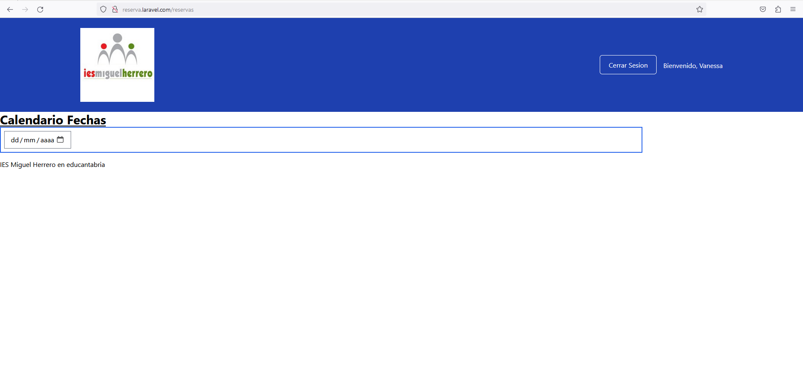
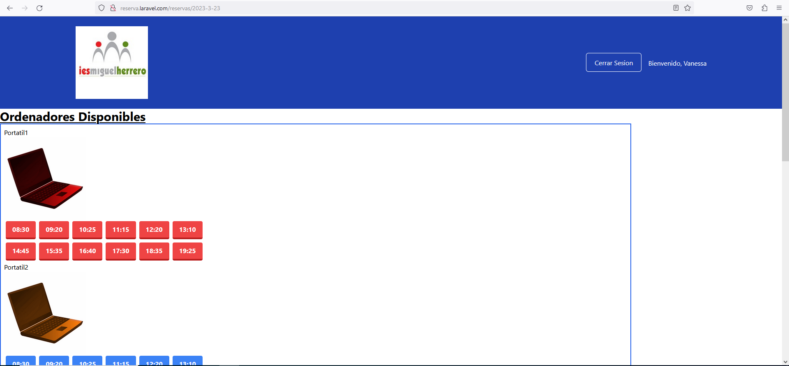
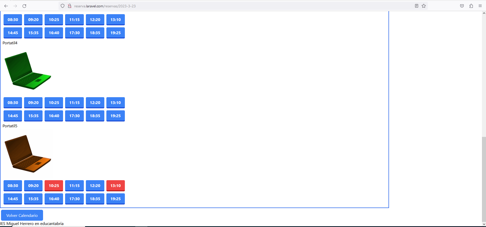
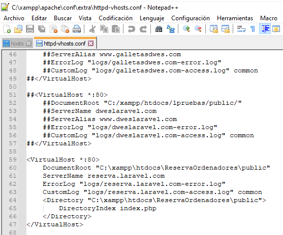
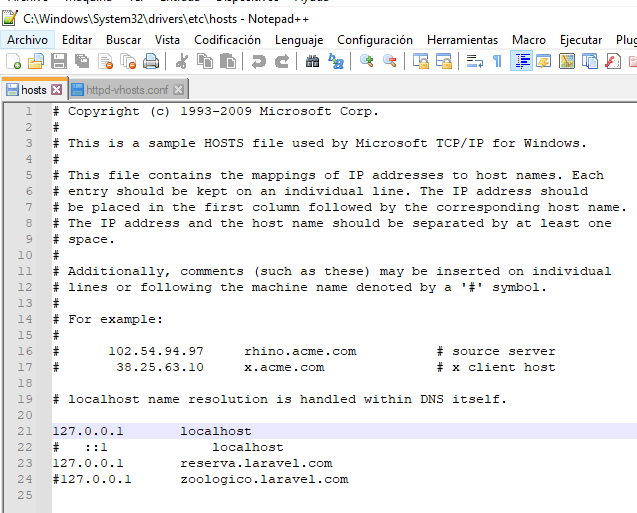

# ReservaOrdenadores
## Reserva de portátiles del departamento de informática

1.Proyecto
- Carpeta ReservaOrdenadores
>
2.Guia de estilos y prototipos
- Proyecto_Intramodular.docx
- Proyecto_Intramodular.pdf
>
3.Segumiento
-  Diario.pdf
-  Issues
>
4.Visual de la web
>

>
Visual index
>

>

>
Visual de la reserva (edit)
>
5.Archivos VirtualHost
>

>
Archivo vhost de xampp
>

>
Archivo hosts de Windows
